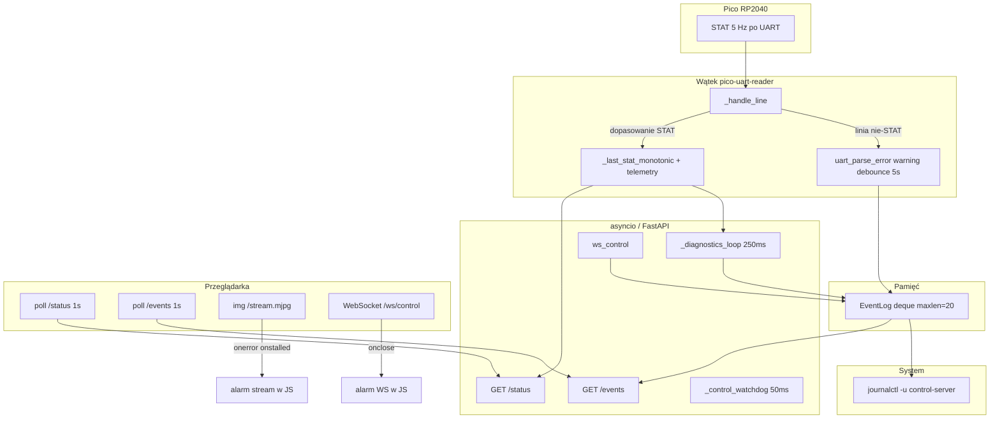

# Faza 3 Pi — pełne podsumowanie sesji Cursor (diagnostyka, KI-1, `/events`)

> Dokument zbiorczy: kontekst z czatu, plan architekta, implementacja agenta Pi,
> historia commitów i opis działania systemu. Uzupełnia krótszy plik
> [`03-pi-diagnostyka.md`](03-pi-diagnostyka.md) oraz wpis w `ITERATIONS.md`.

- **Data sesji:** 2026-06-03
- **Agent:** Pi Agent (Cursor)
- **Branch:** `phase3`
- **Zakres katalogu:** wyłącznie `pi/` (+ dokumentacja w `docs/iterations/`, `ITERATIONS.md`)

---

## 1. Przebieg czatu (co było omawiane)

### 1.1 Wejście — prompt Fazy 3 od architekta

Adrian przekazał gotowy prompt dla **Pi Agenta — Faza 3**, z kontekstem:

- Faza 1 (serwer, kamera, UART, WS, UI) i Faza 2 (firmware Pico: STAT 5 Hz, drive, serwa, watchdog) są ukończone; UART działa na sprzęcie.
- Główny dług: **KI-1 — fałszywe „Pico: połączony”**.
- Cel Fazy 3 z `PROJECT.md` §6: panel diagnostyczny, żywość Pico po świeżości STAT, logowanie zdarzeń.

Workflow z `AGENTS.md`: **Plan → akceptacja → Agent**. Agent nie edytuje `PROJECT.md`, `pico/`, `esp32/`.

### 1.2 Tryb Plan — analiza stanu wyjściowego

Przed implementacją agent przeczytał kod i ustalił:

| Element | Stan przed Fazą 3 | Problem |
|---------|-------------------|---------|
| `pico_link.py` | `connected = True` po otwarciu `/dev/serial0` | Port na Pi istnieje bez Pico — flaga ≠ życie |
| `_handle_line` | Parsuje STAT, aktualizuje telemetrię | Brak timestampu → brak miary świeżości |
| `/status` | `pico_connected: pico.connected` | UI pokazywało „połączony” przy samym porcie |
| `index.html` | Zielony tekst przy `pico_connected` | Widoczna manifestacja KI-1 |
| Konfiguracja | Brak sekcji `diagnostics` | Progi miały trafić do YAML, nie hardcode |

Kontrakt API (addytywny, zatwierdzony przez architekta, opisany już w `PROJECT.md` §5.2):

- `/status` + `pico_alive`, `stat_age_ms` (istniejące pola bez zmiany znaczenia).
- Nowy `GET /events`.
- **Watchdog Pi 500 ms** (failsafe sterowania) ≠ **detekcja życia** (`pico_stale_ms` ~1000 ms).

### 1.3 Pytanie w Planie

Agent zapytał o format pola `ts` w zdarzeniach `/events`:

- **Wybrano:** `uptime_s` serwera (float) — spójne z `/status`, lekkie dla ESP32 w Fazie 6.

### 1.4 Implementacja (Agent)

Po akceptacji planu zaimplementowano pełny zakres A–G z promptu (patrz sekcja 3).

### 1.5 Pierwsze commity sesji

Początkowo powstał **jeden** commit feat:

- `050dada` — `feat(pi): diagnostyka, zywosc Pico po STAT (KI-1) i /events`
- `39f63b0` — dopisek hashy w dokumentacji

### 1.6 Druga prośba Adriana — podział commitów

Adrian poprosił o **trzy osobne commity** zgodnie z propozycją z planu:

1. `feat(pi): wykrywanie zywosci Pico po swiezosci STAT (KI-1)`
2. `feat(pi): endpoint /events i task diagnostyczny zdarzen`
3. `feat(pi): panel diagnostyczny UI + prog batt z histereza`

Agent wykonał `git reset --mixed cb22bfe` (cofnięcie historii, zachowanie plików w drzewie roboczym), następnie **logicznie podzielił** zmiany na trzy commity feat + commit dokumentacji.

### 1.7 Ta prośba — plik .md z pełnym podsumowaniem

Ten dokument.

---

## 2. Problem KI-1 (słowami)

**Objaw:** Panel i `/status` sugerowały, że Pico jest „połączone”, gdy tylko Raspberry Pi miał otwarty port szeregowy (`/dev/serial0`). Port jest dostępny nawet bez podłączonego Pico lub bez nadawania ramek `STAT`.

**Przyczyna:** `pico.connected` ustawiane na `True` w `_try_connect()` — semantyka „port otwarty”, nie „Pico żyje”.

**Naprawa:**

- `pico_connected` — **bez zmiany znaczenia** (port otwarty).
- Nowe: `pico_alive` — świeżość ramek `STAT` (< `pico_stale_ms`).
- UI rozróżnia **trzy stany** (brak portu / port bez STAT / żywy).

**Status:** KI-1 zamknięte w warstwie Pi + UI testowe.

---

## 3. Co zostało zaimplementowane (pliki i odpowiedzialności)

### 3.1 Nowe i zmienione pliki

| Plik | Rola |
|------|------|
| `pi/src/config.py` | `DiagnosticsConfig`, merge w `load_config` |
| `pi/config.yaml` | Sekcja `diagnostics` z progami |
| `pi/src/pico_link.py` | Timestamp STAT, `alive`, `stat_age_ms`, reset, opcjonalny `uart_parse_error` |
| `pi/src/event_log.py` | **Nowy** — ring buffer + `logging` → journald |
| `pi/src/server.py` | `/status` addytywny, `GET /events`, task 250 ms, zdarzenia WS |
| `pi/src/web/index.html` | Panel diagnostyczny, alarmy, pas zdarzeń |
| `docs/iterations/03-pi-diagnostyka.md` | Podsumowanie iteracji (wzór `_TEMPLATE.md`) |
| `ITERATIONS.md` | Postmortem Fazy 3 na górze listy |

**Nie ruszano:** `pico/`, `esp32/`, `PROJECT.md` (przez agenta), Picamera2 pipeline, KI-2, KI-3 (`transform: rotate`).

### 3.2 Konfiguracja `diagnostics`

```yaml
diagnostics:
  pico_stale_ms: 1000        # brak świeżej STAT → Pico martwe (STAT co 200 ms z Pico)
  batt_warn_v: 4.4
  batt_warn_hysteresis_v: 0.1  # powrót batt_ok dopiero > 4.5 V
  batt_min_valid_v: 3.0      # poniżej = brak pomiaru / dzielnik niepodłączony
  events_buffer_size: 20     # ring; UI pokazuje 8
```

Wszystkie progi w dataclass z defaultami — brak hardcode w logice serwera (UI ma stałe 3.0 / 4.4 V jako duplikat do wyświetlania).

---

## 4. Jak to działa — architektura i przepływy

### 4.1 Diagram przepływu danych



### 4.2 Żywość Pico (`PicoLink`)

**Zapis (wątek readera, pod `_telemetry_lock`):**

- Przy każdej poprawnie sparsowanej ramce `STAT`: `self._last_stat_monotonic = time.monotonic()`.

**Odczyt (właściwości):**

- `stat_age_ms`: `None` jeśli nigdy nie było STAT; inaczej `int((monotonic() - last) * 1000)`.
- `alive`: `False` gdy `stat_age_ms is None` **lub** `stat_age_ms >= pico_stale_ms`; inaczej `True`.

**Zerowanie timestampu** (`_last_stat_monotonic = None`):

- `_disconnect()`, `_handle_disconnect()`
- Na początku `_try_connect()` (przed `connected = True`) — żeby stary czas nie dał fałszywego `alive` po ponownym otwarciu portu.

**`connected`:** nadal tylko „port UART otwarty”.

### 4.3 Bufor zdarzeń (`EventLog`)

- `collections.deque(maxlen=events_buffer_size)` + `threading.Lock`.
- Kolejność w JSON: **najstarsze → najnowsze na końcu**.
- `emit(level, code, message)`:
  - `ts` = uptime serwera w momencie zdarzenia (float, sekundy od startu aplikacji).
  - Mapowanie do `logging`: info→INFO, warning→WARNING, critical→ERROR.
- **Bez plików logów na SD** — trwałość operacyjna = journald; UI = ring w RAM.
- Debounce **5 s** na kod `uart_parse_error` (żeby szum UART nie zalał paska).

### 4.4 Task diagnostyczny (`_diagnostics_loop`, co ~250 ms)

Trzyma snapshot poprzedniego stanu (`DiagnosticsSnapshot`) i emituje zdarzenie **tylko na przejściu**:

| Warunek przejścia | `code` | `level` |
|-------------------|--------|---------|
| `alive`: false→true | `pico_alive` | info |
| `alive`: true→false | `pico_dead` | critical |
| `mode` → `failsafe` | `failsafe_enter` | critical |
| `mode` z `failsafe` | `failsafe_exit` | info |
| `connected`: false→true | `uart_connect` | info |
| `connected`: true→false | `uart_disconnect` | warning |
| batt ważne i `< batt_warn_v` | `batt_low` | warning |
| batt ważne i `> warn + hysteresis`, latch był low | `batt_ok` | info |

**Strażnik baterii (Faza 2 bring-up):**

- `batt_valid` = `batt_v is not None` **i** `batt_v > batt_min_valid_v` (domyślnie 3.0 V).
- Poniżej progu: **nie** emituj `batt_low` / `batt_ok`, **nie** zmieniaj latcha (pływający GP26 ~1.4 V bez dzielnika).
- Histereza: alarm przy `< 4.4 V`, powrót `batt_ok` dopiero przy `> 4.5 V`.

**Świadomie poza taskiem serwera:**

- `stream_up` / `stream_down` — tylko alarm w JS (`img.onerror`, `onstalled`).
- Szybkie reconnecty WS — `ws_connect` / `ws_disconnect` w `finally` handlera WebSocket (nie w tasku 250 ms).

### 4.5 Watchdog sterowania (bez zmian kontraktu)

`_control_watchdog` co 50 ms: brak komendy WS > 500 ms → `STOP` na UART, `mode = "failsafe"`. To **osobna** warstwa od `pico_alive` (1000 ms bez STAT).

### 4.6 API HTTP / WebSocket

**`GET /status`** (addytywnie):

```json
{
  "uptime_s": 12.3,
  "pico_connected": true,
  "pico_alive": false,
  "stat_age_ms": null,
  "batt_v": 1.42,
  "dist_cm": 0,
  "mode": "idle"
}
```

**`GET /events`:**

```json
{
  "events": [
    {"ts": 5.1, "level": "info", "code": "uart_connect", "message": "Port UART otwarty"},
    {"ts": 8.2, "level": "critical", "code": "pico_dead", "message": "Pico martwe — brak świeżych ramek STAT"}
  ]
}
```

**WebSocket** `/ws/control` — bez zmian formatu komend; dodane tylko zdarzenia przy `accept` i w `finally`.

### 4.7 UI (`index.html`)

**Stan ciągły** (poll `/status` co 1 s):

- Tryb, uptime, dystans.
- Bateria: `— (dzielnik?)` gdy `batt_v` null lub ≤ 3.0 V; inaczej napięcie; czerwony styl gdy valid i < 4.4 V.
- Pico — trzy stany tekstowe (patrz sekcja 2).

**Alarmy** (lista czerwona, gdy aktywne):

- Brak życia Pico (`!pico_connected` lub `!pico_alive`).
- `mode === 'failsafe'`.
- Niskie batt (valid i < 4.4 V).
- Stream niedostępny (JS).
- WebSocket rozłączony (JS).

**Pas zdarzeń:** ostatnie 8 z `/events`, poll 1 s, kolory: info / warning / critical.

**Sterowanie:** D-pad, suwaki pan/tilt, STOP — bez zmian funkcjonalnych z Fazy 1.

---

## 5. Kody zdarzeń (słownik)

| `code` | Skąd emitowane | Typowy `level` |
|--------|----------------|----------------|
| `pico_alive` | task 250 ms | info |
| `pico_dead` | task 250 ms | critical |
| `failsafe_enter` | task 250 ms | critical |
| `failsafe_exit` | task 250 ms | info |
| `uart_connect` | task 250 ms | info |
| `uart_disconnect` | task 250 ms | warning |
| `batt_low` | task 250 ms | warning |
| `batt_ok` | task 250 ms | info |
| `ws_connect` | handler WS | info |
| `ws_disconnect` | handler WS `finally` | warning |
| `uart_parse_error` | `PicoLink._handle_line` | warning (debounce) |

Zarezerwowane w spec, **nie** emitowane z serwera w tej fazie: `stream_up`, `stream_down` (tylko UI).

---

## 6. Wymagania twarde i edge case’y (z promptu — spełnienie)

- Degradacja bez Pico: serwer i UI działają, czerwone stany, brak crashy.
- `stat_age_ms = null` przy braku ramek (nie 0, nie wielka liczba).
- Thread-safety: STAT i ring pod lockami; task asyncio tylko czyta właściwości.
- Ring ograniczony `maxlen` — brak wycieku pamięci.
- LF w plikach źródłowych (repo `.gitattributes`).
- KI-2, KI-3, firmware, protokół UART — poza zakresem.

---

## 7. Historia commitów na branchu `phase3`

Po `cb22bfe` (stan przed Fazą 3):

| Hash | Message | Zawartość logiczna |
|------|---------|-------------------|
| `8388985` | `feat(pi): wykrywanie zywosci Pico po swiezosci STAT (KI-1)` | `DiagnosticsConfig` (pico_stale_ms), `PicoLink` alive/age, `/status` + pola |
| `f6d23cd` | `feat(pi): endpoint /events i task diagnostyczny zdarzen` | pełna sekcja diagnostics w YAML, `event_log.py`, task, WS events, parse errors |
| `f23dadc` | `feat(pi): panel diagnostyczny UI + prog batt z histereza` | `index.html` — panel, alarmy, events feed |
| `2c1c121` | `docs(repo): podsumowanie Fazy 3 Pi (KI-1 zamkniete)` | `03-pi-diagnostyka.md`, `ITERATIONS.md` |

Wcześniejsze monolityczne commity (`050dada`, `39f63b0`) zostały **zastąpione** powyższą sekwencją na prośbę użytkownika.

---

## 8. Weryfikacja na sprzęcie (checklista z planu)

1. **Bez Pico / bez STAT:** port może być otwarty → UI: „port otwarty, brak ramek STAT”, `pico_alive: false`, `stat_age_ms: null`.
2. **Z Pico (STAT 5 Hz):** `pico_alive: true`, `stat_age_ms` ~ 0–200 ms, zielony wskaźnik.
3. **Zatrzymanie Pico / UART:** po > 1 s → `pico_dead` w `/events`, `pico_alive: false`.
4. **Batt ~1.4 V (brak dzielnika):** brak `batt_low` w events; UI „dzielnik?”.
5. **Failsafe:** brak WS > 500 ms → `failsafe_enter`; kolejna komenda → `failsafe_exit`.
6. **Logi:** `journalctl -u control-server -f` — wpisy przy zdarzeniach.
7. **Stream:** zablokuj `/stream.mjpg` → alarm w JS (bez pola w `/status`).

---

## 9. Uruchomienie

```bash
cd pi
python -m venv .venv
source .venv/bin/activate   # Windows: .venv\Scripts\activate
pip install -r requirements.txt
python -m src.main
```

- UI: `http://<adres-pi>:8000/`
- Status: `http://<adres-pi>:8000/status`
- Zdarzenia: `http://<adres-pi>:8000/events`
- Logi systemd: `journalctl -u control-server -f`

---

## 10. Co dalej (poza tą sesją)

| Temat | Faza / status |
|-------|----------------|
| KI-1 fałszywe „połączony” | **Zamknięte** (Pi + UI) |
| KI-2 wyścig shutdown `pico-uart-reader` | Faza 5 |
| KI-3 obrót streamu CSS | Faza 5, bez zmian w tej sesji |
| HC-SR04, dist realny w STAT | Faza 4 (Pico) |
| ESP32 pilot — lekki poll `/status` | Faza 6 |
| Progi batt w `/status` dla klientów | opcjonalnie Faza 6 |

---

## 11. Powiązane dokumenty w repo

- [`PROJECT.md`](../../PROJECT.md) §5.2 — kontrakt API (zaktualizowany przez architekta)
- [`03-pi-diagnostyka.md`](03-pi-diagnostyka.md) — krótkie podsumowanie iteracji
- [`ITERATIONS.md`](../../ITERATIONS.md) — postmortem na liście iteracji
- Plan sesji (wewnętrzny Cursor): `pi_faza_3_diagnostyka` — nie edytować w repo przez agenta

---

*Wygenerowano jako pełne podsumowanie sesji Cursor — Faza 3 Pi, 2026-06-03.*
